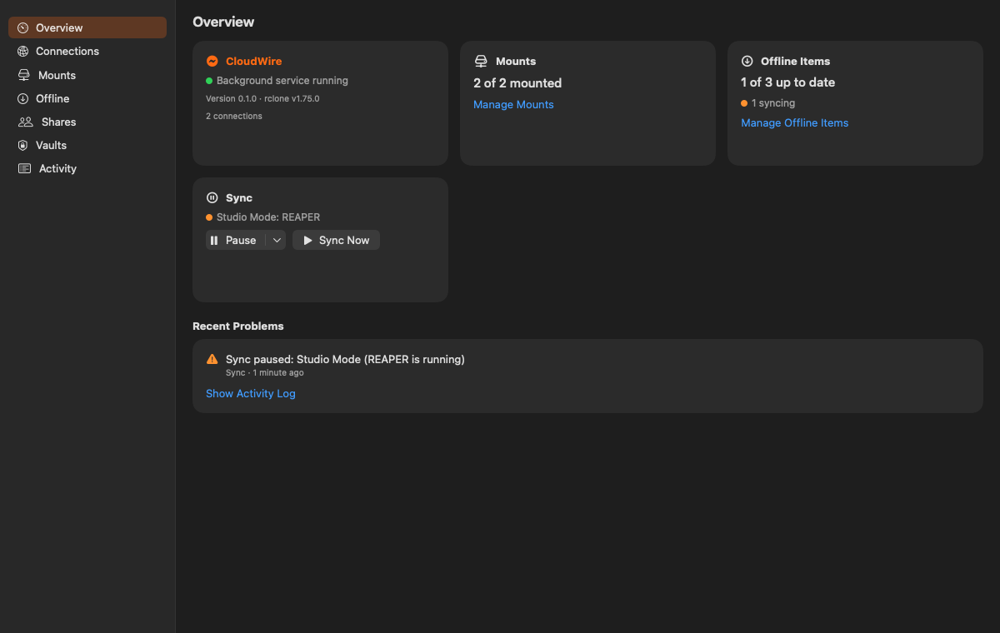
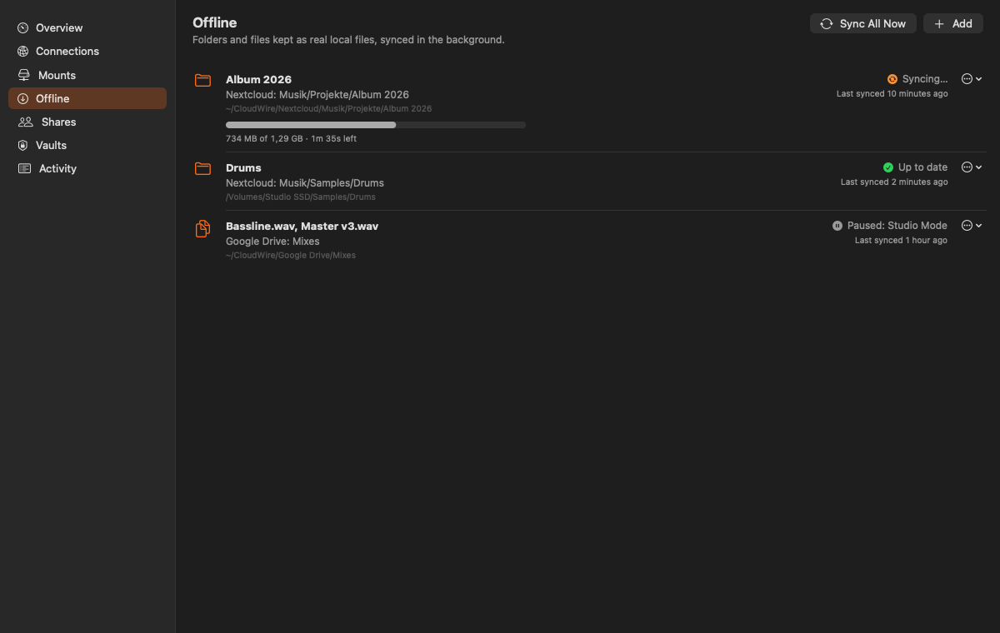
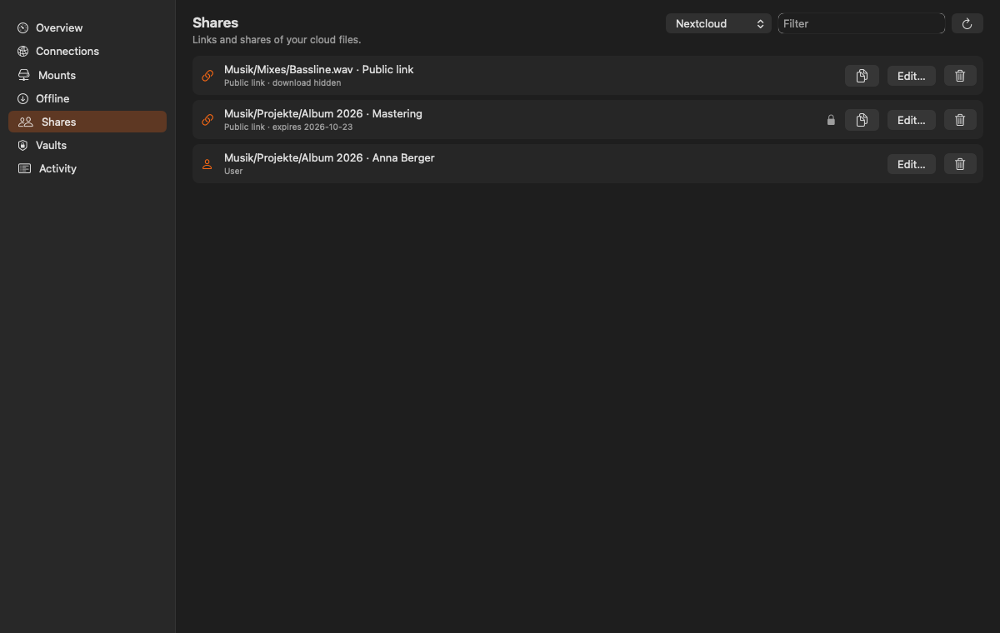
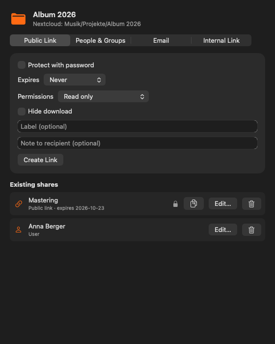
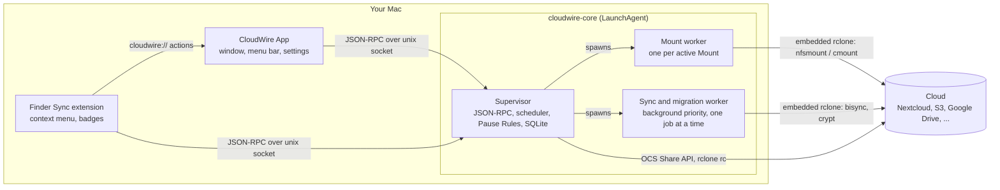

<p align="center">
  
</p>

<p align="center">
  <strong>Your cloud, wired to your Mac. Stream everything, keep what matters offline at SSD speed.</strong>
</p>

<p align="center">
  <a href="https://github.com/DonMikone/CloudWire/actions/workflows/ci.yml"></a>
  <a href="https://github.com/DonMikone/CloudWire/releases"></a>
  <a href="LICENSE"></a>
  
  
</p>

<p align="center">
  <a href="https://github.com/DonMikone/CloudWire/releases"></a>
</p>

CloudWire is a free, open-source cloud storage client for macOS. It works with Nextcloud, ownCloud, Google Drive, OneDrive, Dropbox, iCloud Drive, Box, pCloud, Amazon S3, WebDAV, SFTP and every other cloud that [rclone](https://rclone.org) supports ([full list](#supported-clouds)). It mounts your cloud as Finder drives that stream on demand, and it keeps the folders you work with as real local files that sync both ways in the background. Sharing and client-side encryption are one right-click away in Finder.

## Why CloudWire

Virtual-file clients keep files in a cache that the system may evict at any time, so a project that opened instantly yesterday may download again today. Mount tools tend to stall Finder when the network hiccups. Neither is great when a DAW or video editor needs hundreds of files at SSD speed.

CloudWire separates the two jobs:

- **Mounts** give you the whole cloud in Finder, streamed on demand and cached.
- **Offline Items** are plain APFS files in a folder you choose, on the internal SSD or an external drive. Your apps read them at full disk speed, with no cache in between. CloudWire syncs them in the background at the lowest system priority and stays out of the way while you work.

Everything heavy runs in a small background service built on rclone, so closing the window never stops your drives or your sync.

## Features

| Area | What you get |
| --- | --- |
| **Mounts** | Any [supported cloud](#supported-clouds) as a Finder drive under `~/CloudWire/Mounts`. Uses the built-in macOS NFS client by default; FUSE (FUSE-T or macFUSE) can be selected per Mount when installed. Simple options (read-only, cache size, auto-mount) plus every rclone VFS, mount and NFS option in an advanced form. Mounts come back after crashes, sleep and network changes. |
| **Offline Items** | A cloud folder, or selected files of one folder, kept as real local files and synced both ways with rclone bisync. Choose the Storage Location per item, including external drives; moving it relocates files without downloading again. Conflicts keep both versions (`Bassline.conflict 2026-09-23 1405.wav`). A Mass-Delete Guard stops any run that would delete more than half of an item until you decide. |
| **Pause Rules** | Studio Mode pauses syncing while Logic Pro, Ableton Live, REAPER, Cubase and other listed apps run. Syncing also pauses on battery or Low Power Mode, on a personal hotspot or in Low Data Mode, and above a CPU threshold. Upload and download bandwidth limits apply to every sync. Manual pause for one hour, until tomorrow morning, or until you resume. |
| **Sharing** | For Nextcloud and ownCloud: public links with password, expiry, permissions, hidden download, label and note; internal links; user, group and email shares; list, edit and delete every share. Server policies such as enforced passwords are shown and honoured. Other providers get public links through rclone, tracked in a local registry. |
| **Vaults** | Client-side encrypted folders based on rclone crypt with encrypted file and folder names. Unlock with a password (optionally stored in the Keychain), recover with a one-time Recovery Key, open the same Vault on another Mac, and export an rclone-compatible config for emergencies. Existing folders can be encrypted in place after a verified copy. |
| **Finder integration** | Right-click in any Mount or Offline Item to share, copy a public or internal link, make a folder available offline, encrypt it into a Vault, or open it in the browser. Offline files show badges for synced, syncing, error and conflict. |
| **Activity Log** | Every error, action and sync run with its file list, kept in SQLite for 30 days or 50 MB. Search, filter by level and category, and export as JSON or CSV. |

The interface is available in English and German and follows the system language.

## Supported clouds

CloudWire embeds rclone v1.75.0, so it speaks to the same 50+ storage systems and 50+ S3-compatible services as rclone itself.

| Kind | Services |
| --- | --- |
| **Personal and team clouds** | Nextcloud, ownCloud, Google Drive, Google Photos, Microsoft OneDrive and SharePoint, Dropbox, iCloud Drive, Box, pCloud, Proton Drive, Mega, Koofr, Jottacloud, HiDrive, Yandex Disk, Mail.ru Cloud, Zoho WorkDrive, Internxt, Filen, PikPak, Seafile, Citrix ShareFile, Files.com, Enterprise File Fabric, Quatrix, OpenDrive, put.io, premiumize.me, 1Fichier, Gofile, Linkbox, Uloz.to, Pixeldrain, SugarSync |
| **Object storage** | Amazon S3, Cloudflare R2, Backblaze B2, Wasabi, Google Cloud Storage, Microsoft Azure Blob Storage and Azure Files, Oracle Cloud Object Storage, OpenStack Swift, IDrive e2, Hetzner, OVHcloud, IONOS, Scaleway, DigitalOcean Spaces, Linode, Storj, MinIO, Ceph, SeaweedFS, Synology C2, Alibaba OSS, Tencent COS, Huawei OBS, Qiniu, QingStor and any other S3-compatible service |
| **Protocols and self-hosted** | WebDAV, SFTP/SSH, FTP, SMB/CIFS, HTTP (read-only), Hadoop HDFS, Sia, Akamai NetStorage |

What works where:

| Feature | Availability |
| --- | --- |
| Mounts, Offline Items, Vaults, Pause Rules, Activity Log | Every cloud above |
| Nextcloud browser login (Login Flow v2) | Nextcloud |
| Full sharing: public links with password and expiry, internal links, user, group and email shares, manage all shares | Nextcloud and ownCloud |
| Public links | Clouds where rclone can create links, for example Google Drive, OneDrive, Dropbox, Box, pCloud, Mega, Koofr, Jottacloud and Backblaze B2 |
| Browser sign-in (OAuth) | Google Drive, OneDrive, Dropbox, Box, pCloud and the other OAuth providers |

CloudWire is tested end to end against Nextcloud. The other providers use the same rclone backends as the `rclone` command line tool; if something does not work with your cloud, please [open an issue](https://github.com/DonMikone/CloudWire/issues).

## Screenshots

<p align="center">
  
</p>

<p align="center">
  
</p>

<p align="center">
  
</p>

<p align="center">
  
</p>

## Installation

Requirements: macOS 14 Sonoma or later, on Apple silicon or Intel.

1. Download the latest `CloudWire-<version>.dmg` from [Releases](https://github.com/DonMikone/CloudWire/releases), open it and drag **CloudWire** into **Applications**.
2. Open CloudWire. Releases are ad-hoc signed until a Developer ID certificate exists, so macOS blocks the first launch:
   - **macOS 15 Sequoia and macOS 26 Tahoe**: after the first attempt, open **System Settings > Privacy & Security**, scroll to the message about CloudWire and click **Open Anyway**.
   - **macOS 14 Sonoma**: right-click (or Control-click) CloudWire in Applications, choose **Open**, then confirm with **Open**.
3. Onboarding asks you to allow the background item. The CloudWire Core runs as a background service and keeps Mounts and syncing alive while the window is closed. If you skipped it, enable CloudWire under **System Settings > General > Login Items & Extensions** (macOS 15 and later) or **System Settings > General > Login Items** (macOS 14).
4. Enable the Finder extension when onboarding asks, or later under **System Settings > General > Login Items & Extensions > Extensions** (macOS 15 and later) or **System Settings > Privacy & Security > Extensions > Added Extensions** (macOS 14).
5. After each update, macOS asks once whether CloudWire may use its Keychain items. Click **Always Allow**. Ad-hoc signed builds get a new signature with every release, which is why the prompt returns once per update.

Each release also contains a `.sha256` file: `shasum -a 256 -c CloudWire-<version>.dmg.sha256`.

## Getting started

1. **Connect Nextcloud.** Open CloudWire, go to **Verbindungen** (Connections) and add a connection. Choose Nextcloud, enter your server address and click **Im Browser anmelden** (Log in with browser). Approve the login in your browser; CloudWire receives an app password and never sees your real password. A manual form for an existing app password is available as well. Other providers use forms generated from rclone's metadata, with browser sign-in where the provider uses OAuth.
2. **Add a Mount.** In **Laufwerke** (Mounts), pick the connection and a cloud folder. The drive appears in Finder under `~/CloudWire/Mounts/<Name>` and mounts again automatically at login.
3. **Make a folder offline.** Right-click a folder inside the Mount and choose **Offline verfügbar machen** (Make available offline), or use **Offline** in the app and pick one folder or files of one folder. By default the files land in `~/CloudWire/<Connection>/<path>`; click **Ändern...** to choose another parent folder, for example on an external SSD, where CloudWire creates a folder named after the cloud folder. CloudWire checks the free space first and then downloads everything once.
4. **Share.** Right-click any file or folder in a Mount or Offline Item and choose **Teilen...** (Share) for all options, or **Öffentlichen Link kopieren** (Copy public link) to put a link on the clipboard immediately.
5. **Create a Vault.** In **Tresore** (Vaults), create a Vault in a cloud folder, choose a password of at least 10 characters and store the Recovery Key somewhere safe; it is shown only once. Mount the Vault or make it available offline to work with the decrypted files.

## How it works



- The **App** is a SwiftUI client. It shows the window, the menu bar item and the settings, and it can be closed at any time.
- The **Finder extension** reads the Mount and Offline roots from the Core, draws badges and builds the context menu. Menu actions open a `cloudwire://` URL that the App handles.
- The **Core** is a Go daemon started by launchd. It embeds rclone as a library and drives it through rclone's in-process rc API, so there is no separate rclone binary. A small supervisor owns the database, the scheduler and the JSON-RPC socket, and spawns worker processes for the actual file work.

Design decisions are recorded in [`docs/adr`](docs/adr), and the project vocabulary in [`CONTEXT.md`](CONTEXT.md).

## Performance and robustness

- **Background priority.** Every sync and migration runs in its own process with `PRIO_DARWIN_BG`, the lowest CPU priority with throttled disk and network I/O. "Sync now" keeps that priority and the bandwidth limit.
- **Pause Rules.** Syncing waits for a 60-second Quiet Period after local changes, and it stops while Studio Mode apps run, on battery, on metered networks, or when the CPU is busy. A running sync is stopped gracefully and resumes later.
- **Process isolation.** Each Mount runs in its own worker process. A stuck or crashing Mount cannot stall the others or the supervisor. Workers are health-checked every minute and after wake or network changes, and restarted with backoff.
- **Mounts survive worker restarts.** An NFS Mount's server listens on a fixed localhost port and keeps its file handles on disk. When a worker is restarted, the new one takes over that port and the macOS NFS client simply reconnects, usually within a few seconds; the volume never disappears from Finder.
- **Low idle cost.** With nothing to sync, the Core consists of the supervisor plus one worker per active Mount. Change detection uses FSEvents locally and cheap remote checks (a single ETag request per Nextcloud item).
- **Crash recovery.** launchd restarts the Core if it crashes, Mounts are re-established automatically, and bisync runs with `--resilient --recover`.

## Security

- **Credentials.** The rclone configuration is encrypted with a random key stored in the macOS Keychain. Nextcloud connections store only an app password, and CloudWire asks the server to revoke it when you delete the connection.
- **Mount servers.** NFS Mounts are served by rclone on `localhost` only, without authentication, like `rclone nfsmount`. Other local user accounts on the same Mac could connect to that port; on shared Macs, prefer FUSE Mounts (FUSE-T or macFUSE).
- **Local API.** The App and the Finder extension talk to the Core over a unix socket in `~/Library/Application Support/CloudWire/` with permissions `0600`. Actions coming from Finder carry a Core-issued token; without it, the App asks for confirmation before changing anything.
- **Vaults.** Each Vault is an rclone crypt remote with encrypted file and folder names. Its random crypt secrets are stored next to the data in `vault.json`, wrapped twice with XChaCha20-Poly1305: once with a key derived from your password (scrypt N=65536, r=8, p=1), once with a key derived from the Recovery Key. Changing the password only re-wraps the secrets. See [ADR 0006](docs/adr/0006-vault-format.md) for the format.
- **Your data stays yours.** Removing an Offline Item or a Vault never touches the cloud copy. Deleting the original of an encrypted folder requires a verified copy and your confirmation.

## Troubleshooting and FAQ

**Which clouds does CloudWire support?**
Every cloud supported by rclone, including Nextcloud, ownCloud, Google Drive, OneDrive, Dropbox, iCloud Drive, Box, pCloud, Proton Drive, Amazon S3, Backblaze B2, Wasabi, WebDAV, SFTP and SMB. See [Supported clouds](#supported-clouds) for the full list and which features each one gets.

**How is CloudWire different from the Nextcloud desktop client, Mountain Duck or rclone mount?**
Virtual-file and mount clients keep your files behind a placeholder or a cache that the system manages. CloudWire does both jobs separately: Mounts stream the whole cloud, and Offline Items keep chosen folders as plain local files at SSD speed with background two-way sync, on a drive you choose. On top of that it adds Finder sharing, Vaults and Pause Rules, and it is free and open source under the MIT License.

**Do I need FUSE?**
No. Mounts use the NFS client built into macOS and need no installation or root rights. If [FUSE-T](https://github.com/macos-fuse-t/fuse-t/releases) or macFUSE is installed, you can switch individual Mounts to FUSE in the Mount editor.

**macOS asks whether an app may access files on a network volume.**
Mounts are NFS volumes, so macOS asks each app once for access to "Network Volumes" the first time it opens files inside a Mount. Allow it for the apps you use with your cloud files. You can change the decision under **System Settings > Privacy & Security > Files & Folders**.

**Where are the logs?**
The Core writes to `~/Library/Logs/CloudWire/core.log`. Sync runs, errors and conflicts are also listed in the app under **Aktivität** (Activity), where you can export them.

**How can I check whether the Core is running?**

```sh
/Applications/CloudWire.app/Contents/MacOS/cloudwire-core rpc core.info
launchctl print gui/$(id -u)/io.github.donmikone.cloudwire.core
```

`cloudwire-core rpc <method> [json]` calls any Core method and prints the result, which is handy for bug reports.

**A sync stopped with "Mass-Delete Guard".**
More than half of the item's files would have been deleted. Open the item in **Offline** and choose **Löschen bestätigen** (Confirm delete) if that was intended, or **Nicht löschen – Dateien wiederherstellen** (Do not delete, restore files) to bring the files back from the other side.

**How do I reset CloudWire completely?**
This removes local settings, Offline copies under `~/CloudWire` and cached data. Cloud data is not touched. Stop the Core first and make sure no Mount is still attached before deleting anything under `~/CloudWire`, because deleting files inside a live Mount deletes them in the cloud.

```sh
/Applications/CloudWire.app/Contents/MacOS/cloudwire-core rpc core.shutdown
mount | grep -i cloudwire   # must print nothing; otherwise wait and run it again
rm -rf "$HOME/Library/Application Support/CloudWire" "$HOME/Library/Caches/CloudWire" "$HOME/Library/Logs/CloudWire"
rm -rf "$HOME/CloudWire"   # Offline copies stored in the default Base Folder
security delete-generic-password -s io.github.donmikone.cloudwire
while security delete-generic-password -s io.github.donmikone.cloudwire.vault >/dev/null 2>&1; do :; done
```

Offline Items stored outside `~/CloudWire` stay where you put them. Then turn off CloudWire under **System Settings > General > Login Items & Extensions** and move the app to the Trash.

## Building from source

Requirements: macOS 14 or later, Xcode 26 or later, Go 1.26, and Homebrew.

```sh
brew install xcodegen librsvg
git clone https://github.com/DonMikone/CloudWire.git
cd CloudWire

make app     # universal Core + Xcode project + Release app  -> build/CloudWire.app
make dmg     # disk image + checksum                        -> build/CloudWire-<version>.dmg
make test    # Go vet and tests, then the CloudWireKit unit tests
```

Other targets:

- `make core-dev` builds the Core for the host architecture only (`build/core/cloudwire-core`), which is what Debug builds of the app embed.
- `make xcodeproj` regenerates `app/CloudWire.xcodeproj` from `app/project.yml`; open it in Xcode for development.
- `make icons` renders the logo SVGs in `assets/logo` into the asset catalog (needs `librsvg`; the generated PNGs are committed).
- `make e2e` runs `scripts/e2e-nextcloud.sh`, an end-to-end test against a disposable Nextcloud in Docker (`nextcloud:stable` on port 8089). It needs a running Docker daemon and the Core at `build/core/cloudwire-core` (`make core-dev`). It starts its own Core with a temporary `CLOUDWIRE_HOME` and a separate Keychain service, so your real CloudWire data is never touched. It covers connections, Mounts, Offline Items, every share kind and Vaults, and removes the container, the temporary directory and its Keychain items afterwards.

Releases are built by GitHub Actions when a `v*` tag is pushed. The workflow signs and notarises automatically once Developer ID secrets are configured; otherwise it publishes an ad-hoc signed DMG.

## Contributing

Issues and pull requests are welcome. Please open an issue first for larger changes so we can agree on the approach. Before submitting, run `make test`, and describe how you verified the change. The domain language in [`CONTEXT.md`](CONTEXT.md) and the decisions in [`docs/adr`](docs/adr) are a good place to start.

## License

CloudWire is released under the [MIT License](LICENSE). Copyright (c) 2026 Mike Kremer.

## Acknowledgements

- [rclone](https://github.com/rclone/rclone) (MIT License) does the heavy lifting for every provider, Mount, sync and Vault.
- [libfuse headers from FUSE-T](https://github.com/macos-fuse-t/libfuse) (LGPL-2.1) are vendored in `core/third_party/fuse` for compiling the optional FUSE support; the FUSE library itself is loaded at runtime only if you installed it.
